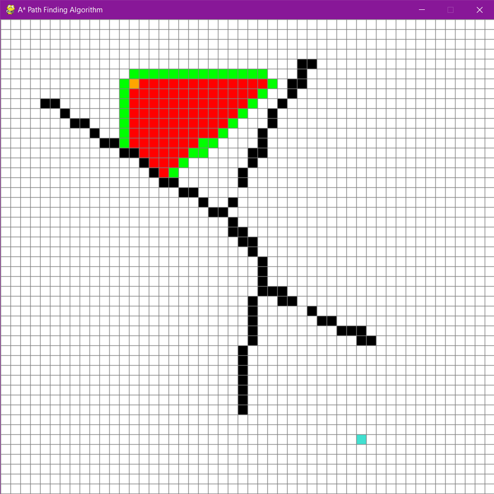

# Path Finder V2.0

#### This version is faster in execution compared to previous version (v1.0)

The project uses a single gui library now:
- Pygame for everything

## How to run
- Download the python file "PathFinder.py" on your machine.
- Make sure you have Python3 installed
- Double click on the file or type `python PathFinder.py` in cmd prompt and hit enter.
- First left click on the cube will be start node
- second left click on the cube will be end node
- 3rd and beyond clicks can be used to create obstacles (you can click and drag)
- right click works as eraser for obstacles
- press space to start

# Path Finder V1.0

#### This is a project which uses DataStructures and Algorithms concept in a practical application.

This project could have been a bunch of numbers but for the sake of User Experience and Learning I decided to implement GUI using two python libraries:

|tKinter:| Pygame|
|--------|-------|
|For User interface |For overall GUI and function|

The primary DataStructure used is <b>Priority Queue</b> and the primary algorithm used is <b>aStar</b>.

## How to run
- Download the python file "PathFinder.py" on your machine.
- Make sure you have Python3 installed
- Double click on the file or type `python PathFinder.py` in cmd prompt and hit enter.
- Enter the start and end node values in the prompt.
- You can enter any set of values between (0, 0) and (48, 48).

- You can choose to show path (makes the program slower but more interesting)

- Left click on a block turns it into an obstacle (white), click and drag is supported for faster operation.
- Right click will turn obstacke block into path block (basically an eraser)

- Hit Space to start the program after you are done creating obstacles.

#### That's all

